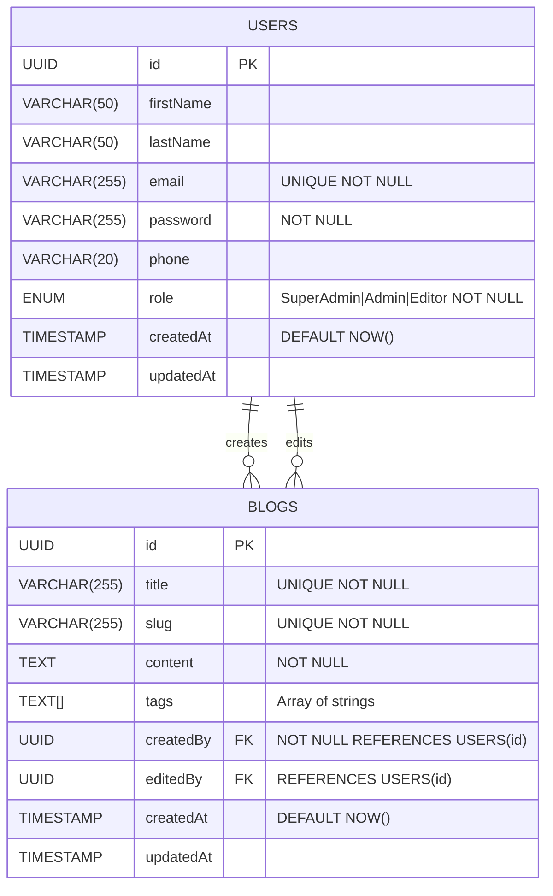

# Simple Blog API

A modern blog API built with NestJS, TypeORM, and PostgreSQL, featuring user authentication, role-based access control, and blog post management.

## Features

- JWT-based Authentication
- Role-based Access Control (Admin/Editor)
- Blog Post Management (CRUD operations)
- Advanced Blog Search & Filtering
- Blog Tags Support
- Secure Password Handling
- API Documentation (Swagger and postman collection)

## Documentation

### ERD (Entity Relationship Diagram)



### System Design

The application follows a modular architecture using NestJS framework:

- **Auth Module**: Handles user authentication and JWT token management
- **Users Module**: Manages user operations and data
- **Blogs Module**: Handles blog post CRUD operations
- **Guards**: Implements authentication and role-based access control

### Project Setup

#### Prerequisites

- Node.js (v16 or higher)
- PostgreSQL (v13 or higher)
- Docker (optional, for containerized setup)

#### Local Setup

1. Clone the repository:

```bash
git clone <repository-url>
cd blogy
```

2. Copy the example environment file:

```bash
cp .env.example .env
```

3. Update the `.env` file with your configuration:

```env
PORT=3000
DB_HOST=localhost
DB_PORT=5432
DB_USERNAME=postgres
DB_PASSWORD=yourpassword
DB_DATABASE=blogdb
JWT_SECRET=your-secret-key
```

4. Install dependencies:

```bash
npm install
```

5. Run database migrations:

```bash
npm run typeorm -- schema:sync -d src/database/data-source.ts && npm run migration:run
```

6. Start the development server:

```bash
npm run start:dev
```

#### Docker Setup

1. Update environment variables in docker-compose.yml if needed
2. Run the application using Docker Compose:

note: -d flag if you want to hide the execution and logs to use the terminal tab

```bash
docker-compose up -d
```

### API Documentation

The API documentation is available at `/api-docs` when the server is running. Below are the key endpoints:

#### Authentication

- **Register User**

  ```http
  POST /auth/register
  Content-Type: application/json

  {
    "email": "user@example.com",
    "password": "password123",
    "firstName": "John",
    "lastName": "Doe",
    "phone": "+1234567890"
  }
  ```

- **Login**

  ```http
  POST /auth/login
  Content-Type: application/json

  {
    "email": "user@example.com",
    "password": "password123"
  }
  ```

#### Blog Posts

- **Create Blog Post** (Requires Auth - Admin/Editor)

  ```http
  POST /blogs
  Authorization: Bearer <token>
  Content-Type: application/json

  {
    "title": "My Blog Post",
    "content": "Blog content here...",
    "tags": ["technology", "programming"]
  }
  ```

- **Get All Blog Posts**

  ```http
  GET /blogs?page=1&limit=10&search=keyword&tags=tech&sortBy=createdAt&order=DESC
  ```

- **Get Single Blog Post**

  ```http
  GET /blogs/:slug
  ```

- **Update Blog Post** (Requires Auth - Admin/Editor)

  ```http
  PUT /blogs/:id
  Authorization: Bearer <token>
  Content-Type: application/json

  {
    "title": "Updated Title",
    "content": "Updated content...",
    "tags": ["updated", "tags"]
  }
  ```

- **Delete Blog Post** (Requires Auth - Admin only)
  ```http
  DELETE /blogs/:id
  Authorization: Bearer <token>
  ```

### Query Parameters

Blog listing supports the following query parameters:

- `page`: Page number (default: 1)
- `limit`: Items per page (default: 10)
- `search`: Search in title and content
- `tags`: Filter by tags (comma-separated)
- `sortBy`: Sort field (createdAt, title, updatedAt)
- `order`: Sort order (ASC, DESC)

### Default Admin Account

After running migrations, a default admin account is created with these credentials:

- Email: admin@blog.com
- Password: admin123

### Deployment

using railway to deployed using Docker. The included Dockerfile and docker-compose.yml provide production-ready configurations.

For production deployment:

1. i doubled check the environment variables
2. Build and push Docker image to docker hub registry
3. Deploy using docker-compose
4. if i hade more time i would use grafana or any mnitoring tool

## License

This project is licensed under the MIT License just for fun
