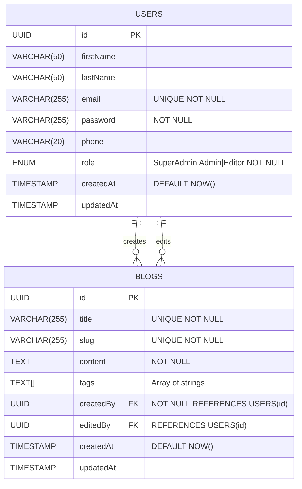

# Simple Blog

description:

## Docs

### ERD



### System Design

### Deployment Info

## Project setup

1. Copy the example environment file:

```bash
cp .env.example .env
```

2. Update the `.env` file with your desired configuration

3. Run the database setup script:

```bash
npm run typeorm -- schema:sync -d src/database/data-source.ts && npm run migration:run
```

Default admin credentials will be loaded from your environment variables. If not set, these defaults will be used:

- Email: admin@blog.com
- Password: admin123
